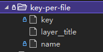

# `Configuration` 模块

🟡 **[文档手册](https://gitee.com/dotnetchina/Furion/tree/experimental/handbook/Configuration) | [使用示例](https://gitee.com/dotnetchina/Furion/tree/experimental/samples/Furion.ConfigurationSamples) | [模块源码](https://gitee.com/dotnetchina/Furion/tree/experimental/framework/Furion.Core/Configuration) | [单元测试](https://gitee.com/dotnetchina/Furion/tree/experimental/tests/Furion.UnitTests/ConfigurationTests) | [集成测试](https://gitee.com/dotnetchina/Furion/tree/experimental/tests/Furion.IntegrationTests/ConfigurationTests)**

## 关于 `配置`

在大多应用程序中，存在一些独立于程序外且可移植的键值对数据，这类数据统称配置。

`配置` 有以下特点：

- `独立于程序的只读变量`

首先，配置是独立于程序的，同一份程序在不同配置下会有不同的行为。其次，配置对于程序是只读的，程序通过配置提供程序读取配置来改变自身行为，但程序不应该取改变配置。

- `存在于应用整个生命周期`

配置贯穿应用的整个生命周期，应用在启动时通过读取配置进行初始化，也可以在运行时根据配置调整行为。

- `配置可以有多种提供方式`

配置也有很多提供方式，常见的有 `环境变量`，`设置文件`，`命令行参数`，`内存配置`、`数据库存储配置`、`目录文件` 等。

- `配置可以实现集中管控`

简单的来说就是将配置信息集中管控，也就是我们常说的 `配置中心`，该方式可以在多个应用之间实现 `高可用`，`实时性`，`治理`、`多环境多集群` 管理等。

## `IConfiguration` 接口

在 `Furion` 框架中，提供 `IConfiguration` 接口读取配置信息，可在启用初始化时、运行时等地方获取其实例。

### `IConfiguration` 实例化

- 在 `WebApplicationBuilder` 中获取

```cs
var builder = WebApplication.CreateBuilder(args);
IConfiguration configuration = builder.Configuration;
```

- 在 `HostBuilder` 中获取

```cs
Host.CreateDefaultBuilder()
    .ConfigureAppConfiguration((context, configurationBuilder) =>
    {
        IConfiguration configuration = context.Configuration;
    });
```

- 在 `构造函数注入` 获取

```cs
private readonly IConfiguration _configuration;
public IOCClass(IConfiguration configuration)
{
    _configuration = configuration;
}
```

- 在 `Startup.cs` 中获取

```cs
public class Startup
{
    public Startup(IConfiguration configuration)
    {
        Configuration = configuration;
    }

    public IConfiguration Configuration { get; }

    public void ConfigureServices(IServiceCollection services)
    {
        // ...
    }

    public void Configure(IApplicationBuilder app, IWebHostEnvironment env)
    {
        // ...
    }
}
```

- 在 `Razor Pages` 中获取

```cs
@page
@model Test5Model
@using Microsoft.Extensions.Configuration
@inject IConfiguration Configuration
```

- 在 `Mvc 视图` 中获取

```cs
@using Microsoft.Extensions.Configuration
@inject IConfiguration Configuration
```

在 `选项配置` 中获取

```cs
services.AddOptions<MyOptions>()
    .Configure<IConfiguration>((option, configuration) => {
        // ...
    })
    .PostConfigure<IConfiguration>((option, configuration) => {
        // ...
    });
    .Validate<IConfiguration>((option, configuration) => {
        // ...
    });
```

### `IConfiguration` 常见方法

- `GetSection(key)`：获取子节点 `IConfigurationSection` 实例，该实例同样继承 `IConfiguration` 接口。
- `Get(key)`：获取节点对象值，返回 `object` 类型。
- `Get<T>(key)`：获取节点对象值，返回 `T` 类型。
- `GetValue(type, key)`：获取单个值，返回 `object` 类型。
- `GetValue(type, key, defaultValue)`：获取单个值，返回 `object` 类型，如果值不存在返回默认值。
- `GetValue<T>(key)`：获取单个值，返回 `T` 类型。
- `GetValue<T>(key, defaultValue)`：获取单个值，返回 `T` 类型，如果值不存在返回默认值。
- `Exists(key)`：判断节点是否存在，返回 `bool` 类型
- `Bind(key, obj)`：读取配置值并绑定到对象中

除上述方法外，`IConfiguration` 接口也提供了索引获取方式，如：`configuration[key]`，该节点总是返回 `string` 类型。

接下来，我们使用 `values.json` 作为配置文件演示 `IConfiguration` 一些常见使用。

- `values.json` 内容

```json
{
  "String": "String",
  "Boolean": true,
  "Boolean2": false,
  "Int": 2,
  "Long": 33333333333333333,
  "Float": -20.2,
  "Decimal": 40.32,
  "Enum": "Male",
  "Enum2": 0,
  "Array": [1, 2, 3, 4],
  "Array2": {
    "0": "one",
    "1": "two",
    "2": "three",
    "3": "four"
  },
  "Dictionary": {
    "key1": "value1",
    "key2": "value2",
    "somekey": "someValue"
  },
  "Object": {
    "Name": "Furion",
    "Version": "Next"
  }
}
```

- 读取配置

```cs
// string 类型
configuration.Get<string>("String");    // => String

// bool 类型
configuration.Get<bool>("Boolean"); // => true
configuration.Get<bool>("Boolean2");    // => false

// int 类型
configuration.Get<int>("Int");  // => 2

// long 类型
configuration.Get<long>("Long");    // => 33333333333333333

// float 类型
configuration.Get<float>("Float");  // => -20.2

// decimal 类型
configuration.Get<decimal>("Decimal");  // => 40.32

// 枚举 类型
configuration.Get<Gender>("Enum");  // => Gender.Male
configuration.Get<Gender>("Enum2"); // => Gender.Male

// 数组类型
configuration.Get<int[]>("Array");  // => [1, 2, 3, 4]
configuration.Get<string[]>("Array2");  // => ["one", "two", "three", "four"]

// 字典类型
configuration.Get<Dictionary<string, string>>("Dictionary");    // { [key1] = "value1", [key2] = "value2", [somekey] = "someValue" }

// 对象类型
configuration.Get<ObjectModel>("Object");   // => { Name: "Furion", Version: "Next" }

// 索引读取方式
configuration["Object:Version"];    // => Next

// 判断键是否存在
configuration.Exists("Object:Author");  // => false

// 获取单个值，如果值不存在返回默认值
configuration.GetValue<string>("Object:Author", "百小僧"); // => 百小僧

// 读取配置值并绑定到对象中
var obj = new YourClass();
confiuration.Bind("Object", obj);   // => { Name: "Furion", Version: "Next" }
```

**小提示：获取下级节点主要通过 `:` 实现，`:` 也称为 `分层键`。**

## 配置提供程序

在 `Furion` 框架中，默认支持以下配置提供程序：

- `文件配置提供程序`：支持 `.json`、`.xml`，`.ini` 配置文件。
- `内存 .NET 对象提供程序`：支持将集合数据存在到内存中供应用读取。
- `目录文件提供程序`：使用目录的文件作为配置键值对，该键为文件名，该值为文件内容。
- `环境变量提供程序`：可从系统环境变量、用户环境变量读取配置。
- `命令行参数提供程序`：支持命令行方式启动应用并且传入 `args` 参数。

除此之外，`Furion` 框架也提供强大的自定义配置提供程序行为，支持从数据库、`Redis` 等任何存储介质提供配置信息。

**注意，越晚注册的配置提供程序存在相同的键会替换前面注册的相同键值。**

### 文件配置提供程序

文件配置提供程序指的是将文件作为配置介质供应用读取，`Furion` 框架支持 `.json`，`.xml`，`.ini` 三种文件配置类型。另外，`.NET` 泛型主机应用程序已默认添加 `appsettings.{Environment}.json` 配置文件。

🔹 `.json` 配置文件

- `json` 配置：

```json
{
  "Key": "Value",
  "Object": {
    "Key": "Value"
  }
}
```

- 添加配置：

```cs
var jsonFile = Path.Combine(Directory.GetCurrentDirectory(), "values.json");

// WebApplicationBuilder 中使用
var builder = WebApplication.CreateBuilder(args);
builder.Configuration.AddJsonFile(jsonFile);
builder.Configuration.AddJsonFile(jsonFile, optional: true);    // 可选（不检测文件是否存在）
builder.Configuration.AddJsonFile(jsonFile, optional: true, reloadOnChange: true);  // 可选 + 更改监听（文件发生更改，自动刷新 IConfiguration 配置信息）
builder.Configuration.AddJsonFile(Path.Combine(Directory.GetCurrentDirectory(), "values.Development.json"));    // 根据不同环境读取不同配置

// 在 HostBuilder 中使用
Host.CreateDefaultBuilder()
    .ConfigureAppConfiguration((context, configurationBuilder) =>
    {
        configurationBuilder.AddJsonFile(jsonFile);
        configurationBuilder.AddJsonFile(jsonFile, optional: true);
        configurationBuilder.AddJsonFile(jsonFile, optional: true, reloadOnChange: true);
        configurationBuilder.AddJsonFile(Path.Combine(Directory.GetCurrentDirectory(), "values.Development.json"));
    });
```

🔹 `.xml` 配置文件

- `xml` 配置：

```xml
<?xml version="1.0" encoding="utf-8" ?>
<configuration>
    <Key>Value</XML>
	<Object>
		<Key>Value</Title>
	</Other>
</configuration>
```

- 添加配置：

```cs
var xmlFile = Path.Combine(Directory.GetCurrentDirectory(), "values.xml");

// WebApplicationBuilder 中使用
var builder = WebApplication.CreateBuilder(args);
builder.Configuration.AddXmlFile(xmlFile);
builder.Configuration.AddXmlFile(xmlFile, optional: true);    // 可选（不检测文件是否存在）
builder.Configuration.AddXmlFile(xmlFile, optional: true, reloadOnChange: true);  // 可选 + 更改监听（文件发生更改，自动刷新 IConfiguration 配置信息）
builder.Configuration.AddXmlFile(Path.Combine(Directory.GetCurrentDirectory(), "values.Development.xml"));    // 根据不同环境读取不同配置

// 在 HostBuilder 中使用
Host.CreateDefaultBuilder()
    .ConfigureAppConfiguration((context, configurationBuilder) =>
    {
        configurationBuilder.AddXmlFile(xmlFile);
        configurationBuilder.AddXmlFile(xmlFile, optional: true);
        configurationBuilder.AddXmlFile(xmlFile, optional: true, reloadOnChange: true);
        configurationBuilder.AddXmlFile(Path.Combine(Directory.GetCurrentDirectory(), "values.Development.xml"));
    });
```

🔹 `.ini` 配置文件

- `ini` 配置：

```ini
Key=Value

[Object]
Key=Value
```

- 添加配置：

```cs
var iniFile = Path.Combine(Directory.GetCurrentDirectory(), "values.ini");

// WebApplicationBuilder 中使用
var builder = WebApplication.CreateBuilder(args);
builder.Configuration.AddIniFile(iniFile);
builder.Configuration.AddIniFile(iniFile, optional: true);    // 可选（不检测文件是否存在）
builder.Configuration.AddIniFile(iniFile, optional: true, reloadOnChange: true);  // 可选 + 更改监听（文件发生更改，自动刷新 IConfiguration 配置信息）
builder.Configuration.AddIniFile(Path.Combine(Directory.GetCurrentDirectory(), "values.Development.ini"));    // 根据不同环境读取不同配置

// 在 HostBuilder 中使用
Host.CreateDefaultBuilder()
    .ConfigureAppConfiguration((context, configurationBuilder) =>
    {
        configurationBuilder.AddIniFile(iniFile);
        configurationBuilder.AddIniFile(iniFile, optional: true);
        configurationBuilder.AddIniFile(iniFile, optional: true, reloadOnChange: true);
        configurationBuilder.AddIniFile(Path.Combine(Directory.GetCurrentDirectory(), "values.Development.ini"));
    });
```

#### 最佳实践

为了简化添加配置文件方式，`Furion` 框架提供了 `AddFile` 方法，该方法可以自动识别文件类型进行注册，同时提供了一些命令操作符可以快速配置文件路径、添加配置文件参数等。如：

```cs
// WebApplicationBuilder 中使用
var builder = WebApplication.CreateBuilder(args);
builder.Configuration.AddFile("values.json");
builder.Configuration.AddFile("values.xml", optional: true);    // 可选（不检测文件是否存在）
builder.Configuration.AddFile("values.ini", optional: true, reloadOnChange: true);  // 可选 + 更改监听（文件发生更改，自动刷新 IConfiguration 配置信息）
builder.Configuration.AddFile("values.json", includeEnvironment: true);    // 根据不同环境读取不同配置

// 在 HostBuilder 中使用
Host.CreateDefaultBuilder()
    .ConfigureAppConfiguration((context, configurationBuilder) =>
    {
        configurationBuilder.AddFile("values.json");
        configurationBuilder.AddFile("values.xml", optional: true);
        configurationBuilder.AddFile("values.ini", optional: true, reloadOnChange: true);
        configurationBuilder.AddFile("values.json", includeEnvironment: true);
    });
```

同时也支持在文件路径中添加参数，格式为 `参数名=参数值`：

```cs
builder.Configuration.AddFile("values.json optional=true reloadOnChange=true includeEnvironment=true");
```

`AddFile` 对获取文件路径也做了一些简化，如：

- 如果文件名以 `@` 或 `~` 开头，自动拼接 `Directory.GetCurrentDirectory()` 路径，如：`@furion.json` 或 `~furion.json`，最终路径为：`项目启动目录/furion.json`。
- 如果文件名以 `&` 或 `.` 开头，自动拼接 `AppContext.BaseDirectory` 路径，如：`&furion.json` 或 `.furion.json`，最终路径为：`项目启动目录/bin/furion.json`。
- 如果文件名以 `/` 或 `!` 开头或包含 `:`，则认为是绝对路径，如：`D:/furion.json`，`/D:/furion.json` 或 `!D:/furion.json`，最终路径为：`D:/furion.json`。
- 如果文件名不以上述符号开头，则同 `@` 或 `~` 处理方式。

### 内存 .NET 对象提供程序

内存 .NET 对象提供程序指的是将内存字典数据作为配置介质供应用读取。如：

```cs
// WebApplicationBuilder 中使用
var builder = WebApplication.CreateBuilder(args);
builder.Configuration.AddInMemoryCollection(new Dictionary<string, string>()
{
    ["Memory"] = "Value",
    ["Memory:Title"] = "Furion"
});

// 在 HostBuilder 中使用
Host.CreateDefaultBuilder()
    .ConfigureAppConfiguration((context, configurationBuilder) =>
    {
        configurationBuilder.AddInMemoryCollection(new Dictionary<string, string>()
        {
            ["Memory"] = "Value",
            ["Memory:Title"] = "Furion"
        });
    });
```

读取配置：

```cs
var value = configuration["Memory"];    // Value
var title = configuration["Memory:Title"]; // => Furion
```

### 目录文件提供程序

目录文件提供程序指的是使用目录的文件作为配置介质供应用读取，该键为文件名，该值为文件内容。**注意，由于文件名不支持分层键 `:`，所以采用 `__` 双下划线代替。** 如：

- 创建以下目录及文件：



- 添加目录文件提供程序

```cs
var dir = Path.Combine(Directory.GetCurrentDirectory(), "key-per-file");

// WebApplicationBuilder 中使用
var builder = WebApplication.CreateBuilder(args);
builder.Configuration.AddKeyPerFile(dir);

// 在 HostBuilder 中使用
Host.CreateDefaultBuilder()
    .ConfigureAppConfiguration((context, configurationBuilder) =>
    {
        configurationBuilder.AddKeyPerFile(dir);
    });
```

读取配置内容：

```cs
configuration["key"];   // => value
configuration["layer:title"];   // => Furion
configuration["name"];  // 百小僧
```

### 环境变量提供程序

环境变量提供程序指的是将系统（用户）环境变量作为配置介质供应用读取。

在  `Furion`  框架中，环境变量提供程序已默认注册，支持无前缀或  `DOTNET_`  和  `FURION_`  前缀方式，同时也可以自定义环境变量统一前缀。**注意，由于变量名不支持分层键 `:`，所以采用 `__` 双下划线代替。**

- 添加环境变量 `launchSettings.json`

```json
{
  // ...
  "profiles": {
    "Furion.ConfigurationSamples": {
      // ...
      "environmentVariables": {
        "ASPNETCORE_ENVIRONMENT": "Development",
        "Env__Name": "Furion",
        "FURION_Env__Title": "Furion Next"
      }
    },
    "IIS Express": {
      // ...
      "environmentVariables": {
        "ASPNETCORE_ENVIRONMENT": "Development",
        "Env__Name": "Furion",
        "FURION_Env__Title": "Furion Next"
      }
    }
  }
}
```

读取配置内容：

```cs
configuration["ASPNETCORE_ENVIRONMENT"];   // => Development
configuration["Env:Name"];   // => Furion
configuration["Env:Title"];  // Furion Next
```

注意，`DOTNET_` 和 `FURION_` 是框架默认添加的环境变量前缀，如需添加其他后置，可通过下面两种方式添加：

- `AppSettings` 方式：

```json
{
  "AppSettings": {
    "EnvironmentVariablesPrefix": "YourPrefix_"
  }
}
```

- 手动添加方式：

```cs
// WebApplicationBuilder 中使用
var builder = WebApplication.CreateBuilder(args);
builder.Configuration.AddEnvironmentVariables(prefix: "YourPrefix_");

// 在 HostBuilder 中使用
Host.CreateDefaultBuilder()
    .ConfigureAppConfiguration((context, configurationBuilder) =>
    {
        configurationBuilder.AddEnvironmentVariables(prefix: "YourPrefix_");
    });
```

### 命令行参数提供程序

命令行参数提供程序指的应用启动时设置 `args` 命令行参数。在  `Furion`  框架中，命令行参数提供程序已默认注册。

支持以下两种方式设置命令行参数：

- 通过 `dotnet run` 命令行指定：

```bash
# = 号方式
dotnet run Key="Value" Object:Title=Furion

# / 斜杆方式
dotnet run /Key "Value" /Object:Title=Furion

# -- 双横杆
dotnet run --Key "Value" --Object:Title=Furion
```

- 通过 `launchSettings.json` 指定：

```json
{
  // ...
  "profiles": {
    "Furion.ConfigurationSamples": {
      "commandName": "Project",
      "commandLineArgs": "--Key Value --Object:Title=Furion"
      // ...
    },
    "IIS Express": {
      "commandName": "IISExpress",
      "commandLineArgs": "--Key Value --Object:Title=Furion"
      // ...
    }
  }
}
```

读取配置内容：

```cs
configuration["Key"];   // => Value
configuration["Object:Title"];  // Furion
```

### 自定义配置提供程序

除了上面内置的配置提供程序以外，`Furion` 框架还提供强大的自定义配置提供程序功能，如下面添加 `.txt` 配置文件支持。

`values.txt` 配置文件格式如下：

```cs
TXT=VALUE

Txt:Title=FURION
```

1. 首先，创建 `TxtOptions` 配置选项类，用来配置 `txt` 提供程序更多信息，如：

```cs
namespace Furion.ConfigurationSamples;

/// <summary>
/// Txt 配置选项
/// </summary>
public class TxtOptions
{
    /// <summary>
    /// 文件路径
    /// </summary>
    public string? Path { get; set; }
}
```

2. 创建 `TxtConfigurationSource` 配置源，并实现 `IConfigurationSource` 接口，如：

```cs
namespace Furion.ConfigurationSamples;

/// <summary>
/// 自定义 Txt 配置源
/// </summary>
public class TxtConfigurationSource : IConfigurationSource
{
    private readonly Action<TxtOptions> _optionsAction;

    public TxtConfigurationSource(Action<TxtOptions> optionsAction)
    {
        _optionsAction = optionsAction;
    }

    // 主机构建时会自动调用
    public IConfigurationProvider Build(IConfigurationBuilder builder)
    {
        return new TxtConfigurationProvider(_optionsAction);
    }
}
```

3. 创建 `TxtConfigurationProvider` 提供程序并继承 `ConfigurationProvider` 抽象类，同时重写 `Load()` 方法，如：

```cs
using Microsoft.Extensions.FileProviders;

namespace Furion.ConfigurationSamples;

/// <summary>
/// Txt 配置提供器
/// </summary>
public class TxtConfigurationProvider : ConfigurationProvider
{
    public TxtConfigurationProvider(Action<TxtOptions> optionsAction)
    {
        OptionsAction = optionsAction;
    }

    Action<TxtOptions> OptionsAction { get; }

    public override void Load()
    {
        // 解析用户自定义配置
        var options = new TxtOptions();
        OptionsAction(options);

        // 获取文件信息
        var dic = Path.GetDirectoryName(options.Path);
        var fileinfo = new PhysicalFileProvider(dic).GetFileInfo(Path.GetFileName(options.Path));

        // 读取文件内容并转换成字典类型
        using var stream = fileinfo.CreateReadStream();
        var dictionary = new Dictionary<string, string>(StringComparer.OrdinalIgnoreCase);

        using var reader = new StreamReader(stream);
        while (reader.Peek() > -1)
        {
            var lineText = reader.ReadLine()!;
            if (string.IsNullOrWhiteSpace(lineText.Trim()))
            {
                continue;
            }

            var splits = lineText.Split('=', StringSplitOptions.RemoveEmptyEntries);
            dictionary[splits[0]] = splits[1];
        }

        // 设置上下文字典数据
        base.Data = dictionary;
    }
}
```

4. 添加 `TxtConfigurationExtensions` 拓展类，如：

```cs
using Furion.ConfigurationSamples;

namespace Microsoft.Extensions.Configuration;

/// <summary>
/// txt 配置拓展
/// </summary>
public static class TxtConfigurationExtensions
{
    public static IConfigurationBuilder AddTxtConfiguration(this IConfigurationBuilder builder, Action<TxtOptions> optionsAction)
    {
        return builder.Add(new TxtConfigurationSource(optionsAction));
    }
}
```

5. 添加自定义配置处理程序，如：

```cs
var txtFile = Path.Combine(Directory.GetCurrentDirectory(), "values.txt");

// WebApplicationBuilder 中使用
var builder = WebApplication.CreateBuilder(args);
builder.Configuration.AddTxtConfiguration(options =>
{
    options.Path = txtFile;
});

// 在 HostBuilder 中使用
Host.CreateDefaultBuilder()
    .ConfigureAppConfiguration((context, configurationBuilder) =>
    {
        configurationBuilder.AddTxtConfiguration(options =>
        {
            options.Path = txtFile;
        });
    });
```

读取配置：

```cs
configuration["TXT"];   // => VALUE
configuration["Txt:Title"];  // FURION
```

## `ChangeToken` 配置更改监听

`Furion` 框架也提供了全局静态类 `ChangeToken` 监听配置更改，如：

```cs
ChangeToken.OnChange(() => configuration.GetReloadToken(), () =>
{
    // ...
});
```
